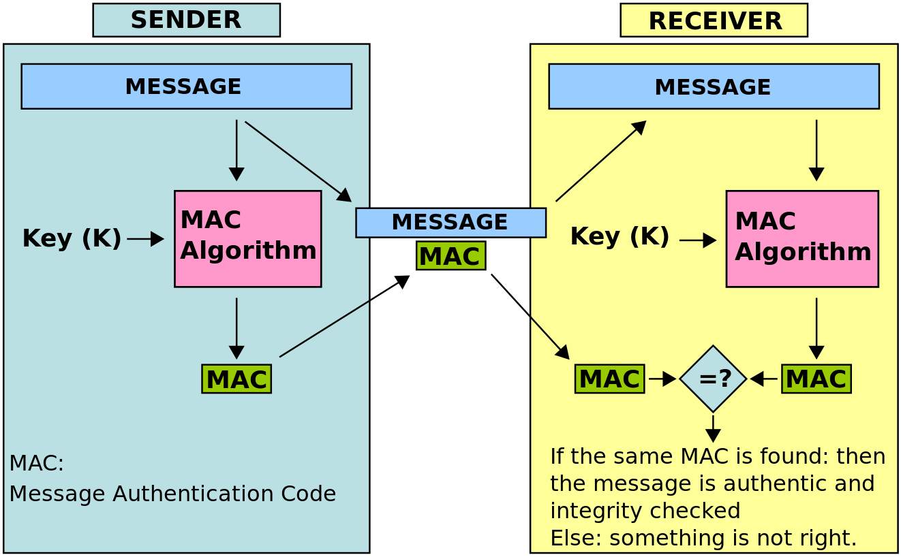

이 게시물은 해시 함수와 암호화 해시 함수의 차이를 구분하고 대표적인 SHA 알고리즘의 사용 사례(best pratice)와 취약점에 대해 설명합니다. 이를 통해 안전한 패스워드의 저장 방법 또는 전송 계층 보안(TLS)으로 한걸음 다가가기 위한 사전 교육 단계의 목적을 가지고 있습니다. 

그런 다음  [안전한 패스워드 저장 - NAVER D2](https://d2.naver.com/helloworld/318732),  [버즈빌의 개발 이야기- 보안 프로토콜 TLS 1.3](https://brunch.co.kr/@mobiinside/1482)와 같은 게시물을 읽는 것을 추천합니다. 

## 해시, 해시 함수

[해시 함수](https://ko.wikipedia.org/wiki/%ED%95%B4%EC%8B%9C_%ED%95%A8%EC%88%98)는 임의의 길이의 데이터를 고정된 길이의 데이터로 매핑하는 함수이며 체크섬, 핑거프린트, 손실 압축, 확률화 함수, 오류 수정 코드, 암호 등의 개념과 어느 정도 중첩되지만 각각의 용도와 요구 사항이 다르게 설계되고 최적화됩니다. [해시(또는 해시값)](https://ko.wikipedia.org/wiki/%ED%95%B4%EC%8B%9C)은 해시 함수로 가공한 결과를 말하며 또한 해시 코드, 해시섬, 체크섬 등으로 불립니다.

> hello = a591a6d40bf420404a011733cfb7b190d62c65bf0bcda32b57b277d9ad9f146e
### 해시 테이블

해시가 사용되는 대표적인 사례는 해시 테이블입니다. 자바스크립트에서 [Map / Set / WeakSet / WeakMap은 모두 해시 테이블을 사용합니다. - V8 on Twitter](https://twitter.com/v8js/status/958046113390411776) 

**해시 테이블**은 해시 함수를 사용하여 키를 해시값으로 매핑하고, 이 해시값을 색인(index) 혹은 주소 삼아 데이터의 값(value)을 키와 함께 저장하는 [자료 구조](https://ko.wikipedia.org/wiki/%EC%9E%90%EB%A3%8C_%EA%B5%AC%EC%A1%B0)입니다.

아직 사용 되지않은 공간을 마련해야 하는 단점이 있지만 값과 매핑된 해시를 이용하면 값을 매번 비교할 필요가 없어 빠릅니다. 
## 암호화 해시(Cryptographic Hash)

[암호화 해시 함수](https://ko.wikipedia.org/wiki/%EC%95%94%ED%98%B8%ED%99%94_%ED%95%B4%EC%8B%9C_%ED%95%A8%EC%88%98)는 [해시 함수](https://ko.wikipedia.org/wiki/%ED%95%B4%EC%8B%9C_%ED%95%A8%EC%88%98)의 일종으로, 암호화 해시 함수가 가져야 하는 성질은 다음과 같습니다.

* **역상 저항성(preimage resistance)**: 주어진 해시에 대해 입력값을 찾는 것이 계산상 어렵다. 즉,  [제 1 역상 공격](https://ko.wikipedia.org/wiki/%EC%97%AD%EC%83%81_%EA%B3%B5%EA%B2%A9) 에 대해 안전해야 한다. 이 성질은  [일방향함수](https://ko.wikipedia.org/wiki/%EC%9D%BC%EB%B0%A9%ED%96%A5%ED%95%A8%EC%88%98) 와 연관되어 있다.
* **제 2 역상 저항성(second preimage resistance)**: 입력 값에 대해, 그 입력의 해시 값을 바꾸지 않으면서 입력을 변경하는 것이 계산상 어렵다.  [제 2 역상 공격](https://ko.wikipedia.org/wiki/%EC%97%AD%EC%83%81_%EA%B3%B5%EA%B2%A9) 에 대해 안전해야 한다.
* **충돌 저항성(collision resistance)**:  [해시 충돌](https://ko.wikipedia.org/wiki/%ED%95%B4%EC%8B%9C_%EC%B6%A9%EB%8F%8C) 에 대해 안전해야 한다. 같은 해시 값을 생성하는 두 개의 입력값을 찾는 것이 계산상 어려워야 한다.

> **제 1 역상 공격**(first preimage attack): 해시값이 주어져 있을 때, 그 해시값을 출력하는 입력값을 찾는다.
> 
> **제 2 역상 공격**(second preimage attack): 입력값이 주어져 있을 때, 그 입력과 같은 해시값을 출력하는 다른 입력값을 찾는다. 즉, 제 2 역상 공격은 제 1 역상 공격에서 원본 메시지까지 주어져 있는 경우이다.
> 
> **해시 충돌**: 서로 다른 두 개의 입력값에 대해 동일한 출력값을 내는 상황을 의미한다. 해시 함수가 무한한 가짓수의 입력값을 받아 유한한 가짓수의 출력값을 생성하는 경우,  [비둘기집 원리](https://ko.wikipedia.org/wiki/%EB%B9%84%EB%91%98%EA%B8%B0%EC%A7%91_%EC%9B%90%EB%A6%AC) 에 의해 해시 충돌은 항상 존재한다.

 **따라서, 암호화 해시 함수의 특성은 다음과 같습니다.** 

* 동일한 입력값으로 항상 동일한 해시를 생성합니다.
* 주어진 입력값에 대해 빠르게 해시 연산을 수행합니다. 
* 해시로부터 입력 값을 생성하는 것은 계산상 어렵습니다.. 
* 동일한 해시를 가진 두 개의 서로 다른 메시지를 찾는 것은 계산상 어렵습니다.
* 메시지를 아주 조금만 변경해도 해시가 광범위하게 변경되어 이전 해시와 관련성을 찾을 수 없습니다. 
## 암호학(Cryptography) vs 암호화(Encryption)

[암호학](https://ko.wikipedia.org/wiki/%EC%95%94%ED%98%B8%ED%95%99)은 안전한 통신을 제공하는데 사용되는 알고리즘, 수학, 정보 이론, 전송, 암호화 등의 다양한 기술(technologies)과 기법(techniques)을 포함하는 반면, [암호화](https://ko.wikipedia.org/wiki/%EC%95%94%ED%98%B8%ED%99%94)는 암호학의 기법중 하나로 메시지를 인코딩 하는 프로세스입니다. 

그러나 종종 이 둘을 모두 암호화로 혼동하여 부르는 경향이 있으며, 이로 인해 때때로 “암호화 해시(cryptography hash function)는 암호화(Encryption)가 아니다”라는 식의 논쟁을 유발하기도 합니다.

해시를 생성하는 것을 암호화(Encryption)라고 부르지는 않지만 우리가 소프트웨어를 개발할 때 안전한(secure) 통신 목적을 달성하기 위해서는 다양한 [암호학](https://ko.wikipedia.org/wiki/%EC%95%94%ED%98%B8%ED%95%99) 기법을 동시에 사용하게 되며 이때 [암호화](https://ko.wikipedia.org/wiki/%EC%95%94%ED%98%B8%ED%99%94) 및 암호화 해시 함수등은 암호학의 구성요소가 됩니다.

## What is SHA
[SHA(Secure Hash Algorithm)](https://ko.wikipedia.org/wiki/SHA)는 가장 널리 사용되는 함호화 해시 중 하나로, 1993년  [미국 국가안보국](https://ko.wikipedia.org/wiki/%EB%AF%B8%EA%B5%AD_%EA%B5%AD%EA%B0%80%EC%95%88%EB%B3%B4%EA%B5%AD) (NSA)에 의해 설계 되었으며 미국 연방 정보 처리 표준입니다.  

> SHA 함수군에 속하는 최초의 함수는 공식적으로 **SHA**라고 불리지만, 나중에 설계된 함수들과 구별하기 위하여 **SHA-0**이라고도 불린다. 2년 후 SHA-0의 변형인 **SHA-1**이 발표되었으며, 그 후에 4종류의 변형, 즉 **SHA-224**, **SHA-256**, **SHA-384**, **SHA-512**가 더 발표되었다. 이들을 통칭해서 **SHA-2**라고 하기도 한다.

## SHA 알고리즘의 사용 사례

### 파일 식별
전체 파일을 전달하는 해시 함수를 실행하면 항상 동일한 출력이 생성됩니다. 이것은 **소프트웨어를 배포할 때** 특히 유용합니다. 예를 들어 Linux 배포판을 다운로드하려는 경우 **체크섬(checksum)** 파일을 가져와서 다운로드 중에 파일이 변경되었거나 손상되었는지 확인할 수 있습니다.

### Git
Git에서는 변경 내역(커밋)의 해시(SHA1)를 생성하여, 데이터를 관리합니다.

> commit 4bb84d634098d152d478b2959fc2f2c4fc44e0d9  
Merge: 500edefa dcbe9b19  
Author: Sung Yeol Yim  
Date:   Mon May 25 08:36:10 2020 +0000

[Git의 차기 해시 알고리즘](https://lwn.net/Articles/811068/)으로 SHA 256을 채택하고 적용하려는 시도가 있으며 천천히 실현되고 있습니다. 

### 파티셔닝 데이터
해시를 사용하여 데이터가 저장된 위치를 식별하면 해시 파티션이 생깁니다. 이 개념은 상당히 복잡하며 **데이터베이스**와 같이 훨씬 더 복잡한 솔루션에서 사용됩니다. 좋은 예는 [OpenStack](https://www.openstack.org/software/)의 [OpenStack Object Storage](http://openstack.org/projects/storage/) Swift입니다.

### 블록 체인
[How a blockchain works… Let’s make one! | LedgerProjects](http://www.ledgerprojects.com/how-a-blockchain-works-lets-make-one/)
블록체인의 각 블록에는 해시 데이터가 포함됩니다. 이전 블록의 해시 값은 현재 블록의 해시 값을 계산하는 데 사용됩니다.

* [이전블록해시](http://wiki.hash.kr/index.php/%EC%9D%B4%EC%A0%84%EB%B8%94%EB%A1%9D%ED%95%B4%EC%8B%9C)
* [블록체인 기초 개념](https://homoefficio.github.io/2016/01/23/BlockChain-%EA%B8%B0%EC%B4%88-%EA%B0%9C%EB%85%90/)
* [블록체인 기술적 구성 및 원리](https://m.blog.naver.com/PostView.nhn?blogId=shakey7&logNo=221576691305&proxyReferer=https:%2F%2Fwww.google.com%2F)
### 암호화폐 (Bitcoin)
블록체인과 비트 코인은 같은 것이 아닙니다. 차이점에 대해 알고 싶다면 [Bitcoin and Blockchain - Bloomberg](https://www.bloomberg.com/quicktake/bitcoins) 게시물을 확인하세요.  
비트코인에서 SHA-256은 어떻게 동작할까요? 

[**채굴**]
SHA-256은 채굴자가 이전 블록 해시 매개 변수를 알아내기 위해 필요합니다. 그렇게 하려면 채굴자는 다음 공식을 따라야 합니다.

> 이전 블록 해시 = SHA-256 (SHA-256 (블록 헤더))

[**비트코인 주소 생성**]
비트 코인 주소의 핵심은 공개 키입니다. 공개 키는 RIPEMD160과 SHA-256에 의해 해시 됩니다.

> A = RIPEMD160 (SHA-256 (K))

### HMAC (해시 기반 메시지 인증 코드)
[메시지 인증 코드(MAC)](https://ko.wikipedia.org/wiki/%EB%A9%94%EC%8B%9C%EC%A7%80_%EC%9D%B8%EC%A6%9D_%EC%BD%94%EB%93%9C)는 메시지 인증에 쓰이는 작은 크기의 정보로, 송신자와 수신자가 사전에 공유한 비밀키를 이용하여 메시지의 데이터를 인증하고 더불어 무결성을 보호합니다. 

MAC에 사용되는 Key에 따라 GMAC, HMAC, NMAC, CMAC, UMAC, VMAC 등으로 구분되며, [HMAC](https://en.wikipedia.org/wiki/HMAC)은 SHA-1, SHA-256등의 해시를 이용합니다.

### SSL(Secure Sockets Layer) 인증서

웹 사이트 및 웹 서비스의 보안은 인증서 파일을 기반으로 하며, 보안 연결을 설정하고 인증하는데 사용됩니다. 이 인증서에는 SHA-256과 같은 알고리즘을 사용하여 생성된 암호화 요소가 포함되어 있습니다.

2011년부터 2015년 까지는 기본 알고리즘이 SHA-1이었지만, 취약점이 발견되어 2016년 12월 31일부터 웹 사이트의 서명 해시 알고리즘은 SHA-256이 산업 표준이 되었습니다.

### 패스워드 저장

생성된 해시로부터 원래의 입력값을 알아내지 못하는 단방향 해시의 특성을 이용하여 패스워드 데이터의 유출로 인한 2차 피해를 방지(원본 패스워드를 알아내지 못하도록) 하기 위해 SHA 알고리즘을 이용하여 해시를 생성하고 이를 저장합니다. 

> SHA 취약점에 따라 한국인터넷진흥원(KISA)에는 SHA-256 이상의 알고리즘을 사용할 것을 권고 하고 있습니다.

## SHA 취약점 및 주의 사항
### SHA1 취약점

2013년까지 발행된 디지털 인증서의 98%는 전적으로 SHA-1에 의존했습니다. 2017년에 크롬 브라우저는 SHA-1 인증서가 적용된 사이트 접속 시 페이지 표시를 거부 하였습니다. 그러나 실제로는  [단계적으로 SHA-1 사용을 줄여감으로써 결국 단종시키겠다고 선언](https://security.googleblog.com/2014/09/gradually-sunsetting-sha-1.html) 함으로서 프로세스는 시작되었습니다.  

* [구글, 구형 암호기술 ‘SHA1’ 허점 입증했다](https://www.zdnet.co.kr/view/?no=20170224153403)
* [각종 인증서 기본이 되는 SHA-1에 충돌 공격 비상](https://www.boannews.com/media/view.asp?idx=48181)

마이크로소프트 역시 [루트 인증서 프로그램의 SHA-1 해시 알고리즘 사용 중단 -2016/1/12](https://support.microsoft.com/ko-kr/help/3123479/microsoft-security-advisory-deprecation-of-sha-1-hashing-algorithm-for) 및  
[SHA-2 코드 서명 지원 요구 사항](https://support.microsoft.com/ko-kr/help/4472027/2019-sha-2-code-signing-support-requirement-for-windows-and-wsus)을 통해 윈도우즈 업데이트에서 SHA-1사용을 제거하였습니다. 
이와 관련하여 저의 게시물 [번역 - 마이크로소프트가 SHA-1 업데이트를 포기한 이유?](/blog/microsoft-is-abandoning-SHA-1-hashes-for-updates)를 읽어 보는 것도 흥미로울 수 있습니다.

### SHA2 취약점
 
SHA-2에 대한 공격은 아직 발견되지 않았고, 안전하다고 알려져 있으나, SHA-1과 비슷한 방법을 사용하기 때문에 공격이 발견될 가능성이 있다고 지적합니다. [미국 표준 기술 연구소](https://ko.wikipedia.org/wiki/%EB%AF%B8%EA%B5%AD_%ED%91%9C%EC%A4%80_%EA%B8%B0%EC%88%A0_%EC%97%B0%EA%B5%AC%EC%86%8C) (NIST)는  [SHA-3](https://ko.wikipedia.org/wiki/SHA-3)로 불리는 새로운 암호화 해시 알고리즘에 대한 후보를 공모하였습니다.

* [왜 SHA-3을 사용하지 않는가 - ITWorld Korea](http://www.itworld.co.kr/news/108321)
* [한국인터넷진흥원 권고 암호화 알고리즘](https://seed.kisa.or.kr/kisa/bbs/faq.do)

> 공공기관과 민간 기관의 권고 사양이 달라 때때로 혼란을 유발함.

### 패스워드 해시 알고리즘

패스워드를 저장하는 목적으로 SHA-2를 사용하는 것은 과연 안전할까요? 

#### 무차별 대입공격(brute-force attack)
[무차별 대입 공격](https://ko.wikipedia.org/wiki/%EB%AC%B4%EC%B0%A8%EB%B3%84_%EB%8C%80%EC%9E%85_%EA%B3%B5%EA%B2%A9)은 가능한 모든 입력값을 대입하여 암호를 풀어내는 공격 방법으로, 대부분의 암호화 방식은 이론적으로 무차별 대입 공격에 대해 안전하지 못하며, 충분한 시간이 존재한다면 암호화된 정보를 해독할 수 있습니다. 

> [GOTO 2019 • AppSec: From the OWASP Top Ten(s) to the OWASP ASVS • Jim Manico - YouTube](https://youtu.be/nvzMN5Z8DJI?t=1542) 이 영상에서 GPU를 사용하는 고성능 머신으로 1초에 무려 950억 개의 SHA-256 해시 계산이 가능했다고 말합니다.

저는 위 영상을 보고 [Amazon EC2 P2](https://aws.amazon.com/ko/blogs/korea/new-p2-instance-type-for-amazon-ec2-up-to-16-gpus/) 인스턴스에서 [hashcat](https://hashcat.net/hashcat/)을 이용하여 패스워드 무차별 대입 공격 데모를 작성하였습니다. 이때 1초에 1억 개 이상의 해시를 생성하였으며 salt 가 포함되지 않은 SHA-256으로부터 생성된 해시를 비교하여 8자리의 패스워드를 단 1초 만에 알아낼 수 있었습니다. 

#### Dictionary Attack (사전 공격)
 원본( [평문](http://www.ktword.co.kr/abbr_view.php?nav=&m_temp1=4240&id=532) )에 대해 미리 계산된  [해쉬값](http://www.ktword.co.kr/abbr_view.php?nav=&m_temp1=1211&id=960) 들을 모아서 사전 형태로 만들어놓고 대입해보는 공격 방법입니다.

> (유사) 미리 계산해둔 테이블을 레인보우 테이블 (Rainbow Table)이라고 합니다.

* [Sha256 Decrypt & Encrypt - More than 15.000.000.000 hashes](https://md5decrypt.net/en/Sha256/)
* [SHA-256 - Password SHA256 Hash Decryption - Online Decoder/Encoder](https://www.dcode.fr/sha256-hash)
* [Ultimate Hashing and Anonymity toolkit](https://md5hashing.net/hash/sha256)

위와 같은 사이트에서 미리 수집한 해시 값을 이용하여 원본 데이터를 유추할 수 있습니다. 

## 요약
성공적인 정보 보안 체계로 이끄는 주요 목표는 기밀성(Confidentiality), 무결성(Integrity), 인증성(Authentication), 사용성(Availability) 그리고 부인방지(non-repudiation)입니다. 

암호화 해시를 이해하는 것은 다음의 주제로 나아가는데 도움이 됩니다. 

SHA-2와 같은 암호화 해시는 각각의 목표에 따라 상호 보완적으로 다양하게 사용되고 있으며, 빠른 계산 성능으로 인해 패스워드와 같은 민감한 데이터를 저장하는 것은 주의해야 하며, SHA 알고리즘 보다 느리게 수행되는 알고리즘이 선호 됩니다. 

[참고 문헌]  
* [Introduction · OWASP Cheat Sheet Series](https://cheatsheetseries.owasp.org/)  
* [Summary of Key LastPass Security Principles - Whitepaper](https://assets.cdngetgo.com/1d/ee/d051d8f743b08f83ee8f3449c15d/lastpass-technical-whitepaper.pdf)  
* [What Is Hashing? | Binance Academy](https://www.binance.vision/security/what-is-hashing)  
* [HMAC](https://www.joinc.co.kr/w/man/12/hmac)  
* [OpenStack Swift eventual consistency analysis & bottlenecks](https://julien.danjou.info/openstack-swift-consistency-analysis/)  
* [What Is SHA-256 And How Is It Related to Bitcoin? - Mycryptopedia](https://www.mycryptopedia.com/sha-256-related-bitcoin/)  
* [Cryptography vs Encryption | 6 Awesome Differences You Should Learn](https://www.educba.com/cryptography-vs-encryption/)  
* [블록체인 기술의 핵(核), ‘암호 해시’ 파헤치기 – Samsung Newsroom Korea](https://news.samsung.com/kr/%EB%B8%94%EB%A1%9D%EC%B2%B4%EC%9D%B8-%EA%B8%B0%EC%88%A0%EC%9D%98-%ED%95%B5%E6%A0%B8-%EC%95%94%ED%98%B8-%ED%95%B4%EC%8B%9C)  
* [OpenStack Swift eventual consistency analysis & bottlenecks](https://julien.danjou.info/openstack-swift-consistency-analysis/)  
* [Difference Between Hashing and Encryption](https://www.ssl2buy.com/wiki/difference-between-hashing-and-encryption)  
* [SHA-1 Collision Attacks, Explained](https://www.howtogeek.com/238705/what-is-sha-1-and-why-will-retiring-it-kick-thousands-off-the-internet/)  