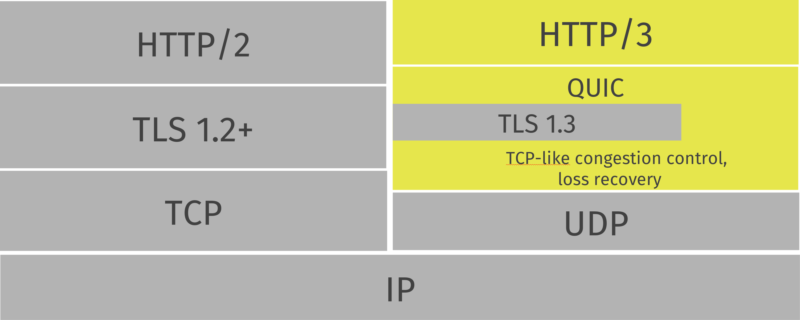

팀 스터디 발표 시간에 관련 이슈가 언급되어, 보충 설명을 위해 작성된 게시물입니다.
HTTP2, HTTP3을 이해하는데 약간의 도움이 될 수 있습니다. 

## HTT 1.x

모두 알고 있듯, HTTP는 비 연결성 프로토콜입니다. 많은 수의 리소스 요청을 처리하기 위해서 다수의 커넥션을 사용합니다. 그리고 [브라우저의 동시 연결 제한](https://docs.pushtechnology.com/cloud/latest/manual/html/designguide/solution/support/connection_limitations.html) 때문에 [도메인 샤딩](https://developer.mozilla.org/ko/docs/Web/HTTP/Connection_management_in_HTTP_1.x)이라는 기법을 추가로 사용하여 리소스 연결 속도를 개선하고 있습니다.
그러나 이런 순차적인 연결은 **HTTP Head of line blocking** 이슈를 유발합니다.

특정 요청의 응답에 지연이 발생하면 그 다음의 요청에도 영향을 받는다는 문제 입니다.

## HTTP 2

구글의 SPDY에서 유래되어 HTTP2 표준으로 명명  
HTTP2는 다음의 방법으로 이 문제를 해결합니다.

- 영속적인 커넥션 사용
- 멀티플렉싱 - 여러 개의 HTTP 요청/응답을 하나의 TCP 연결에서 보냄.

## HTTP 3

그러나 HTT2는 여전히 다른 종류의 어려움을 겪고 있습니다.

HTT2는 TCP를 사용하고 있기 때문에 만약 TCP 스트림에서 하나의 패킷이 손실된 경우 패킷이 재 전송 및 수신될 때까지 모든 스트림을 대기 시킵니다. 이를 **TCP Head of line blocking**이라고 부릅니다.

HTTP3는 UDP를 이용하여 이 문제를 해결하며, TCP와 유사하게 구현된 QUIC 프로토콜을 이용하여 패킷의 순서와 신뢰를 보장합니다.
